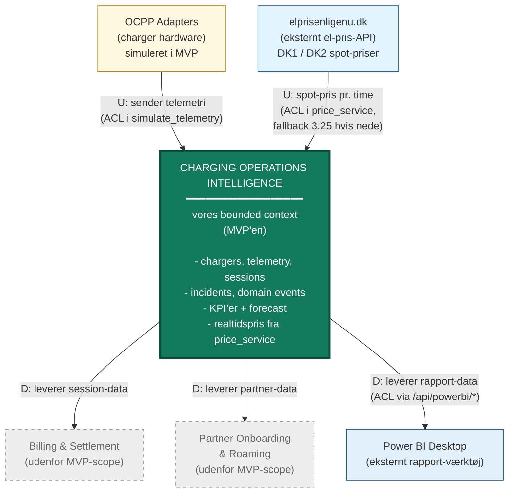

# Bounded Context Map — skabelon

> **Hvad denne fil er:** En tekstuel beskrivelse af hvad din Bounded Context
> Map skal indeholde. Brug den som "grundrids" når du tegner i draw.io,
> PowerPoint, Lucidchart eller hånden. Mermaid-blokken nederst kan også
> renderes direkte hvis du bruger en editor der understøtter det
> (GitHub, VS Code med Mermaid-extension, Obsidian).

---

## Formål

Bounded Context Map'et viser **din MVP placeret i det bredere VoltEdge-landskab**.
Den svarer på: "Hvilke andre systemer/contexts taler din løsning med, og hvilken
retning går data?"

---

## Elementer der skal være med

### Centrum (din MVP)
- **Charging Operations Intelligence** — din bounded context
  - Tegnes som et stort rektangel i midten
  - Skriv "MVP" eller "vores context" i hjørnet så det er tydeligt

### Upstream (sender data IND til din context)
- **OCPP Adapters** (charger-hardware)
  - Sender telemetri ind via simulate_telemetry
  - Markér med pilen pegende ind mod MVP'en
  - Skriv "U" (upstream supplier) ved siden af pilen

- **elprisenligenu.dk** (eksternt el-pris-API)
  - Leverer aktuelle danske spot-priser per time, regionsopdelt (DK1/DK2)
  - Hentes via HTTP GET af `price_service.py`
  - Skriv "U" + nævn at vi har fallback hvis API'et er nede
  - Markér gerne med en anden farve (lyseblå) — det er et eksternt offentligt API, ikke en intern VoltEdge-service

### Downstream (modtager data FRA din context)
- **Billing & Settlement**
  - Modtager session-data til afregning
  - Udenfor MVP-scope, men relevant senere
  - Pil peger fra MVP til Billing
  - Skriv "D" (downstream consumer)

- **Partner Onboarding & Roaming**
  - Modtager session-data til roaming-afregning
  - Også udenfor MVP-scope
  - Pil peger fra MVP til Partner
  - Skriv "D"

- **Power BI Desktop**
  - Henter rapporterings-data via /api/powerbi/*
  - Markér forbindelsen tydeligt — den ER implementeret
  - Pil peger fra MVP til Power BI
  - Skriv "D" (downstream konsument)

---

## Anbefalede farver

| Element | Forslag til farve | Begrundelse |
|---|---|---|
| Din MVP (centrum) | Grøn eller blå (kraftig) | Det er hovedfokus |
| Out-of-scope contexts (Billing, Partner) | Grå eller blegere | Viser at de er udenfor scope |
| Implementerede integrationer (OCPP, Power BI) | Solid farve | Disse er reelt i koden |

---

## Pile / relationer

Brug DDD-notation:
- **U** = Upstream (supplier — leverer data)
- **D** = Downstream (consumer — modtager data)
- **ACL** = Anti-Corruption Layer (oversættelses-lag mellem to contexts)

Pilen tegnes i data-flow retningen. Hvis OCPP sender telemetri til MVP, så peger pilen
fra OCPP til MVP, og OCPP markeres "U" (er upstream), MVP er "D".

### Hvor MVP'en har implementeret ACL

ACL'en sidder altid på **consumer-siden** af en relation — det er den der oversætter
fra eksternt format til vores interne model (eller omvendt). Tre steder i MVP'en:

| Relation | Hvor ACL er implementeret | Hvad den oversætter |
|---|---|---|
| **OCPP → MVP** (vi konsumerer telemetri) | `services.simulate_telemetry` | Råt telemetri → `TelemetryReading` domain object |
| **elprisenligenu.dk → MVP** (vi konsumerer priser) | `price_service.py` | API'ets JSON → `MoneyDkk` value object (inkl. moms, fallback, regions-mapping) |
| **MVP → Power BI** (vi udstiller data) | `services.build_powerbi_*` + `/api/powerbi/*` | Vores interne SQLite-skema → stabilt JSON-datasæt |

Det betyder vi kan **ændre noget på den ene side uden at bryde den anden**. Hvis vi
ændrer en tabel, mærker Power BI det ikke. Hvis elprisenligenu.dk ændrer deres
JSON-format, behøver vi kun rette `price_service.py`, ikke hele domæne-laget.

---

## Mermaid-version (kan renderes direkte)



---

## ASCII-version (hvis du tegner i hånden)

```
   ┌──────────────────────┐         ┌──────────────────────┐
   │   OCPP Adapters      │         │  elprisenligenu.dk   │
   │ (charger hardware)   │         │   (el-pris-API)      │
   └──────────┬───────────┘         └──────────┬───────────┘
              │                                │
              │ U: telemetri                   │ U: spot-pris
              │ [ACL: simulate_telemetry]      │ [ACL: price_service]
              v                                v
   ┌─────────────────────────────────────────────────────────┐
   │                                                         │
   │   CHARGING OPERATIONS INTELLIGENCE                      │
   │   ───────────────────────────────────                   │
   │   vores bounded context (MVP)                           │
   │                                                         │
   │   • chargers, telemetry, sessions                       │
   │   • incidents, domain events                            │
   │   • KPI'er + forecast (ML)                              │
   │   • realtids el-pris (via price_service)                │
   │                                                         │
   └──────┬─────────────────┬─────────────────┬──────────────┘
          │                 │                 │
          │ D               │ D               │ D
          │ session-data    │ partner-data    │ rapport-data
          │                 │                 │ [ACL: /api/powerbi/*]
          v                 v                 v
   ┌────────────┐    ┌──────────────┐   ┌──────────────┐
   │  Billing & │    │   Partner    │   │   Power BI   │
   │ Settlement │    │  Onboarding  │   │   Desktop    │
   │ (out of    │    │  & Roaming   │   │  (ekstern    │
   │  scope)    │    │ (out of      │   │   klient)    │
   │            │    │   scope)     │   │              │
   └────────────┘    └──────────────┘   └──────────────┘

   Tegnforklaring:
     U   = Upstream (leverer data)
     D   = Downstream (modtager data)
     ACL = Anti-Corruption Layer (oversætter til/fra vores interne model)
```

---

## Når du tegner det selv — tjekliste

- [ ] Din MVP står i midten og er tydeligt markeret som hovedfokus
- [ ] OCPP og elprisenligenu.dk er øverst eller venstre (begge er upstream)
- [ ] Billing, Partner og Power BI er nedenunder eller højre
- [ ] Pile har retning (ikke bare linjer)
- [ ] Hver pil har en label med "U" eller "D"
- [ ] **ACL-markering** på de tre relationer hvor det er implementeret (OCPP, elprisenligenu.dk, Power BI)
- [ ] Out-of-scope contexts (Billing, Partner) er visuelt tonet ned (fx grå) og har **ingen** ACL-label
- [ ] Power BI er fremhævet som **implementeret** (ikke out-of-scope)
- [ ] Tegnforklaring (U / D / ACL) står i et hjørne af diagrammet
- [ ] Diagrammet har en titel: "Bounded Context Map — VoltEdge MVP"

---

## Hvad censor kan spørge

> *"Hvorfor er Billing udenfor jeres scope?"*
>
> Fordi MVP'en fokuserer på det operationelle (drift, telemetri, sessions, analytics).
> Billing kræver kontraktlogik og afregningsmodeller der hører til et helt andet
> bounded context — at blande dem ville bryde DDD-princippet om separation of concerns.

> *"Hvordan taler I med Power BI?"*
>
> Via /api/powerbi/* JSON-endpoints. Power BI Desktop henter data via Web-connector
> og refresh'er manuelt. Vores interne database-skema er skjult bag JSON-formatet.

> *"Hvorfor er elprisenligenu.dk en upstream-context?"*
>
> Fordi de leverer data ind til vores context — de aktuelle danske spot-priser per
> time, regionsopdelt på DK1 (vest) og DK2 (øst). Vi har ingen kontrol over deres
> API, men vi har bygget en fallback i `price_service.py` så MVP'en stadig virker
> hvis API'et er nede. Vi ganger spot-prisen med 1.25 for at inkludere 25% moms,
> så tallet matcher hvad en EV-ejer faktisk betaler.

> *"Hvad er en ACL og hvor har I implementeret det?"*
>
> Et ACL (Anti-Corruption Layer) er et oversættelses-lag mellem to bounded contexts.
> Det sidder på consumer-siden og oversætter fra det andre context's sprog til
> vores interne model. Vi har tre i koden:
>
> 1. **`price_service.py`** — oversætter elprisenligenu.dk's JSON til vores interne
>    `MoneyDkk`-værdier. Hvis API'et ændrer struktur, rettes kun denne fil.
> 2. **`services.simulate_telemetry`** — oversætter (simuleret) OCPP-telemetri til
>    `TelemetryReading`-domain-objekter.
> 3. **`/api/powerbi/*` + `services.build_powerbi_*`** — oversætter den modsatte vej:
>    fra vores interne SQLite-skema til et stabilt JSON-datasæt som Power BI forstår.
>    Vi kan ændre vores tabel-struktur uden at bryde Power BI-rapporten.
>
> ACL'en er **separation of concerns mellem contexts**: hver context kan udvikle sig
> uafhængigt så længe ACL'en holder oversættelsen ved lige.
