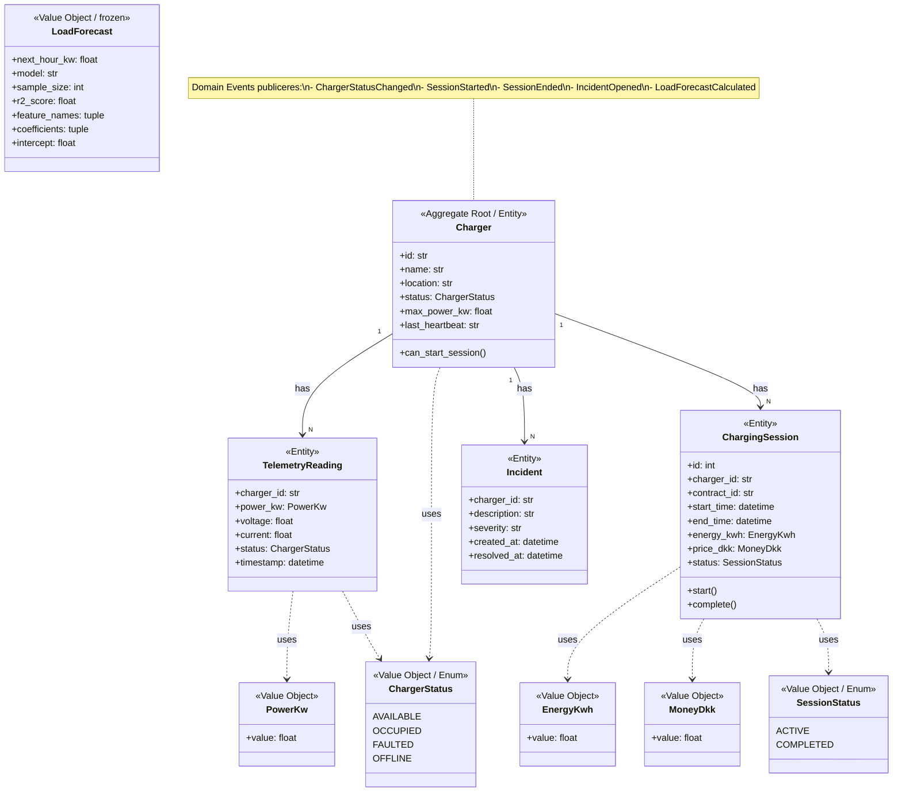

# DDD-Domænemodel — skabelon

> **Hvad denne fil er:** En tekstuel beskrivelse af hvad din domænemodel
> skal indeholde. Brug den som "grundrids" når du tegner i draw.io,
> PowerPoint, Lucidchart eller hånden. Mermaid-blokken nederst kan renderes
> direkte i GitHub, VS Code med Mermaid-extension, eller Obsidian.

---

## Formål

Domænemodellen zoomer **IND** i din bounded context og viser:
- Hvilke entities og value objects der findes
- Hvordan de hænger sammen (1:N relationer)
- Hvilken entity der er aggregate root
- Hvilke domain events der bliver publiceret

Det er en UML-lignende klassediagram, men med DDD-stempler (Entity, Value Object, Aggregate Root).

---

## Elementer der skal være med

### Aggregate root (centrum)

- **Charger** — entity, aggregate root
  - id (str), name, location, status (ChargerStatus), max_power_kw, last_heartbeat
  - Tegnes som det største/mest fremtrædende rektangel
  - Markér tydeligt med "<<Aggregate Root>>" eller en krone-emoji

### Entities (har identitet, knyttet til Charger)

- **TelemetryReading** — en måling fra en charger
  - charger_id (FK), power_kw, voltage, current, status, timestamp

- **ChargingSession** — et opladningsforløb
  - id, charger_id (FK), contract_id, start_time, end_time, energy_kwh, price_dkk, status

- **Incident** — en fejl-hændelse
  - charger_id (FK), description, severity, created_at, resolved_at

Alle tre har 1:N forhold fra Charger (én charger har mange målinger/sessions/incidents).

### Value Objects (immutable, ingen identitet)

- **PowerKw** — effekt i kilowatt (validerer ≥ 0)
- **EnergyKwh** — energi i kilowatt-timer (validerer ≥ 0)
- **MoneyDkk** — pris i danske kroner (validerer ≥ 0)
- **ChargerStatus** (enum) — available / occupied / faulted / offline
- **SessionStatus** (enum) — active / completed
- **LoadForecast** (frozen) — resultat af ML-forecasting, kan ikke ændres efter beregning

Tegnes som mindre bokse omkring centrum, eller listes i en sidebar. Markér tydeligt med "<<Value Object>>".

### Domain Events (forretningsmæssige kendsgerninger)

- **ChargerStatusChanged** — når en charger skifter status
- **SessionStarted** — når en ladesession starter
- **SessionEnded** — når en ladesession slutter
- **IncidentOpened** — når en fejl registreres
- **LoadForecastCalculated** — når forecast publiceres

Tegnes som "post-it"-bokse (gerne gule) i hjørnet eller langs siden. Marker med "<<Domain Event>>".

### Integration Event (separat — fra OCPP-context)

- **TelemetryReceived** — teknisk hændelse fra OCPP-adapteren

Tegnes som en boks i en anden farve eller stiplet, så det er tydeligt at det er
**ikke** et domain event. Eller hold det helt udenfor og henvis til Bounded Context Map.

---

## Anbefalede farver

| Element | Forslag til farve |
|---|---|
| Charger (aggregate root) | Grøn — fremhævet |
| Øvrige entities | Lyseblå |
| Value objects | Gul/orange |
| Domain events | Lilla eller pink post-its |
| Integration event | Grå/stiplet |

---

## Mermaid-version (klassediagram, kan renderes)



---

## ASCII-version (hvis du tegner i hånden)

```
                  ╔════════════════════════════════╗
                  ║  Charger <<Aggregate Root>>    ║
                  ║  ────────────────────────────  ║
                  ║  • id: str                     ║
                  ║  • name, location              ║
                  ║  • status: ChargerStatus       ║
                  ║  • max_power_kw                ║
                  ║  • last_heartbeat              ║
                  ╚═══════╤═══════════╤═══════════╤╝
                          │1:N        │1:N        │1:N
              ┌───────────┘           │           └────────┐
              v                       v                    v
   ┌──────────────────┐  ┌────────────────────┐ ┌────────────────┐
   │ TelemetryReading │  │  ChargingSession   │ │   Incident     │
   │   <<Entity>>     │  │   <<Entity>>       │ │  <<Entity>>    │
   │ ───────────────  │  │ ─────────────────  │ │ ──────────────│
   │ power_kw         │  │ contract_id        │ │ description   │
   │ voltage, current │  │ start_time         │ │ severity      │
   │ status, timestamp│  │ end_time           │ │ created_at    │
   │                  │  │ energy_kwh         │ │ resolved_at   │
   │                  │  │ price_dkk          │ │               │
   │                  │  │ status             │ │               │
   └──────────────────┘  └────────────────────┘ └────────────────┘

   ┌─── VALUE OBJECTS ────────────────────────────────────┐
   │  PowerKw   EnergyKwh   MoneyDkk                      │
   │  ChargerStatus (enum)    SessionStatus (enum)        │
   │  LoadForecast (frozen — ML-resultat)                 │
   └──────────────────────────────────────────────────────┘

   ┌─── DOMAIN EVENTS (gemmes i domain_events-tabel) ─────┐
   │  • ChargerStatusChanged                              │
   │  • SessionStarted                                    │
   │  • SessionEnded                                      │
   │  • IncidentOpened                                    │
   │  • LoadForecastCalculated                            │
   └──────────────────────────────────────────────────────┘

   ┌─── INTEGRATION EVENT (fra OCPP-context) ─────────────┐
   │  • TelemetryReceived  (teknisk hændelse, ikke        │
   │    forretningsmæssig — gemmes i samme tabel for      │
   │    enkelhed, men er begrebsmæssigt noget andet)      │
   └──────────────────────────────────────────────────────┘
```

---

## Når du tegner det selv — tjekliste

- [ ] Charger er fremhævet som aggregate root (størst, anden farve, krone-ikon)
- [ ] Pile mellem Charger og de tre child-entities har "1" og "N" markeringer
- [ ] Hver entity har en label "<<Entity>>"
- [ ] Value objects er tydeligt adskilt (anden farve eller form)
- [ ] Hver value object har "<<Value Object>>" label
- [ ] LoadForecast har "frozen" eller "immutable" markering
- [ ] Domain events listes separat som "post-its" — IKKE med pile til entities
- [ ] TelemetryReceived er adskilt fra de 5 domain events (eller helt udeladt)
- [ ] Diagrammet har en titel: "Domænemodel — Charging Operations Intelligence"

---

## Hvad censor kan spørge

> *"Hvad er forskellen på en entity og et value object?"*
>
> En entity har identitet — to chargers med samme navn er stadig forskellige
> chargers fordi de har forskellige id'er. Et value object har ingen identitet —
> `PowerKw(22.0)` og `PowerKw(22.0)` er den samme værdi.

> *"Hvorfor er Charger jeres aggregate root?"*
>
> Fordi den samler de objekter der skal være konsistente sammen. Når en session
> starter, skal chargerens status ændres til "occupied" SAMTIDIG med at sessionen
> oprettes — det håndteres af `database.transaction()` så vi aldrig kan ende med
> en "halv-skreven" tilstand.

> *"Hvorfor er LoadForecast frozen?"*
>
> Fordi det er resultatet af en ML-beregning. Hvis nogen kunne ændre tallet
> bagefter, ville det miste sin troværdighed som beregning. `frozen=True` i
> Python låser objektet efter oprettelse.
