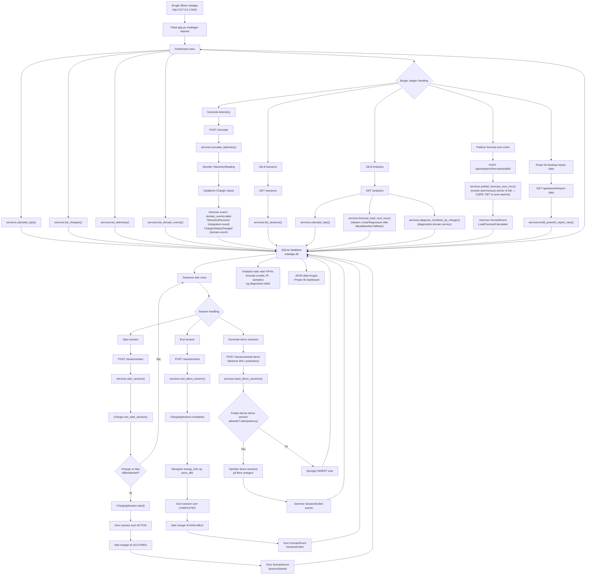
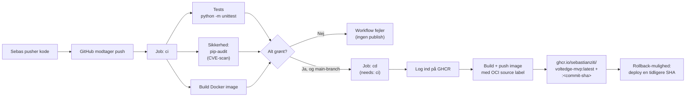
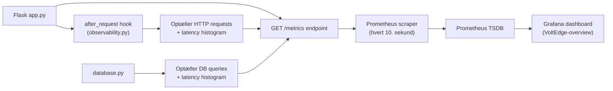

# Eksempelflow: VoltEdge MVP

Dette flowchart viser det typiske bruger- og systemflow i programmet.

## Kort forklaring

Programmet starter i `app.py`, hvor Flask-routes tager imod brugerens handlinger.
Selve forretningslogikken ligger især i `services.py`, mens domæneobjekterne ligger i `domain.py`.
Data gemmes i SQLite-databasen `voltedge.db`.

Et centralt eksempel er start af en session:

1. Brugeren klikker start session.
2. `app.py` kalder `services.start_session()`.
3. `services.py` finder en charger i databasen.
4. Chargeren laves til et `Charger`-domæneobjekt.
5. `Charger.can_start_session()` tjekker om den må starte en session.
6. Hvis ja, oprettes en `ChargingSession` — alt inden for én `database.transaction()`-context manager.
7. Sessionen gemmes i databasen.
8. Chargeren sættes til `occupied` via **atomic claim** (`UPDATE … WHERE status='available'`), så to samtidige requests ikke kan starte en session på samme charger.
9. Der gemmes et domain event: `SessionStarted`.

## CI/CD-flow (DevSecOps)

## Observability-flow (runtime)

